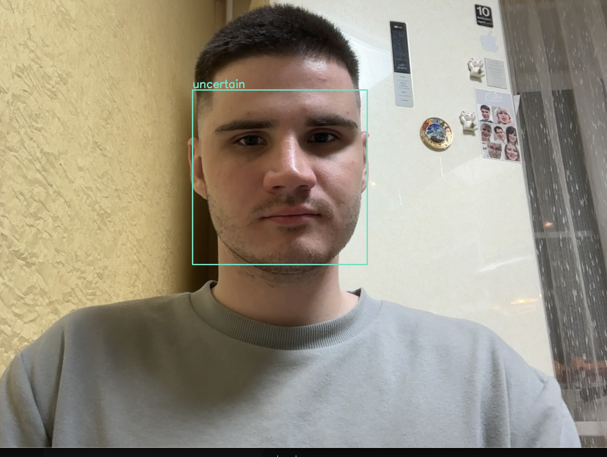

# Распознавание Эмоций



## 💡 Мотивация
Сегодня нейронные сети для распознавания эмоций становятся всё более популярными. Существует девять основных эмоций: радость, грусть, страх, гнев, нейтралитет, неуверенность, удивление, отвращение и презрение. В многих бизнес-сценариях это может быть полезно. Например, в парке аттракционов, где искусственный интеллект (ИИ) может определить, грустит ли человек, и при необходимости помочь ему стать счастливее. Также в банковской сфере, где ИИ-консультант может коммуницировать с клиентами и делать их более счастливыми или менее нервными, основываясь на их эмоциях.

## 📄 Описание Проекта
Использование нейронной сети для распознавания эмоций на изображениях.

## 📁 Структура Проекта
- `emotion_file.txt` - файл с девятью эмоциями, которые может распознать модель.
- `emotion-recognizing-neural-network.py` - файл с реализацией модели распознавания эмоций.
- `frozen_graph.pb` - замороженная модель нейронной сети.
- `training-neural-model.ipynb` - ноутбук с обучением модели.

## 🚀 Установка и Запуск

### Установка зависимостей
Для работы модели необходимо установить следующие библиотеки:

```bash
pip install opencv-python face-recognition numpy
```

### Запуск инференса модели
Для запуска распознавания эмоций в реальном времени с веб-камеры выполните:

```bash
python emotion-recognizing-neural-network.py
```

**Как это работает:**
1. Программа запустится и откроет окно с видео с веб-камеры.
2. Модель будет автоматически обнаруживать лица в кадре.
3. Для каждого обнаруженного лица будет показана рамка с определенной эмоцией.
4. Для остановки программы нажмите клавишу `q`.

**Распознаваемые эмоции:**
- neutral (нейтралитет)
- anger (гнев) 
- contempt (презрение)
- disgust (отвращение)
- fear (страх)
- happy (радость)
- sad (грусть)
- surprise (удивление)
- uncertain (неуверенность)
